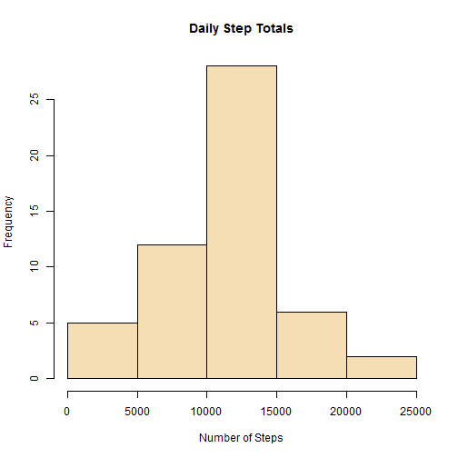
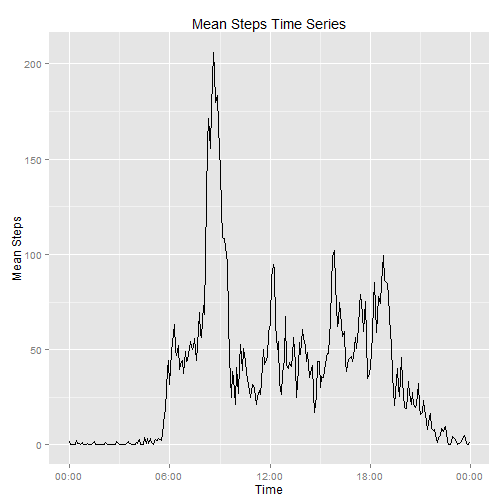
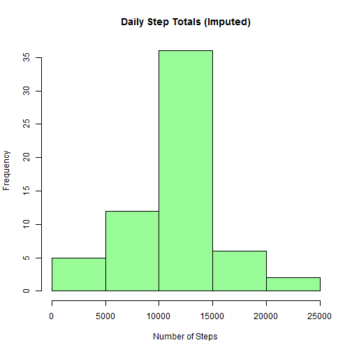
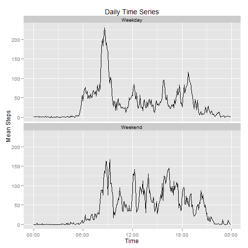

## Loading and preprocessing the data

### Load

The dataset for this assignment is available from the Reproducible
Research course website:

* Data: [Acvitity monitoring data](https://d396qusza40orc.cloudfront.net/repdata%2Fdata%2Factivity.zip)

Uncompress and read the **activity** dataset (activity.zip) from the current working directory.  


```r
unzip("activity.zip")
activity <- read.csv(file = "activity.csv")
```

### Preprocess

There are three variables in this dataset:

* **steps:** Number of steps taken by the subject in 5-minute intervals.
Missing values are coded as `NA`.

Missing values are treated later in this assignment so no preprocessing is 
done.

* **date:** Date on which the measurement was taken in YYYY-MM-DD format.

Dates are converted to R date class.


```r
activity <- transform(activity, date = as.Date(date, format = "%Y-%m-%d"))
```

* **interval:** Integer identifier for the 5-minute interval for which the
measurement was taken.  Format is HHMM (24-hour time) stored as an 
integer (so no leading zeros).

For this assingment the interval variable serves merely as 
a label for each of the 288 5-minute intervals that comprise a day.
For plotting purposes it is convenient to make the interval variable
into a datetime 
class explicitly so that ggplot will correctly interpret it as a time.
Rather than convert the existing interval variable, it is replaced
by a newly constructed vector of POSIXct class: a sequence of times 
starting at midnight and incremented in 5-minute intervals.


```r
activity <- transform(activity, interval = seq(origin, by = "5 min", length.out = 24*60/5))
```

Note:  If the interval variable were left as an integer, 
there would exist unwanted
gaps (..., 50, **55, 100**, 105, 110, ...) in time-series plots as an 
artifact of the integer representation.

## What is mean total number of steps taken per day?

For this part of the assignment missing values are ignored.

Activity data is grouped by day and then the total number of steps is
summed for each day.


```r
library(dplyr)

by.date <- group_by(activity, date)
steps.per.day <- summarize(by.date, total = sum(steps))
```

Histogram of the total number of steps taken each day.


```r
hist(steps.per.day$total,
     col = "wheat",
     main = "Daily Step Totals",
     xlab = "Number of Steps")
```

 

Summary of the total steps per day:


```r
mean.steps <- as.integer(mean(steps.per.day$total, na.rm = TRUE))
median.steps <- median(steps.per.day$total, na.rm = TRUE)
```

* **mean**:  10766 steps/day.
* **median**: 10765 steps/day.

## What is the average daily activity pattern?

For this section we look at average activity over the course of the day.
The data is grouped by interval and averaged over all days.  (Missing data
is excluded.)


```r
by.interval <- group_by(activity, interval)

mean.steps.per.interval <- summarize(by.interval, interval.mean = mean(steps, na.rm = TRUE))
```

Create a time-series plot of mean steps for each interval.


```r
library(ggplot2)
library(scales)

ggplot(mean.steps.per.interval, 
       aes(x= interval, y = interval.mean, group=1)) +
    geom_line() +
    labs(title = "Mean Steps Time Series") +
    labs(y = "Mean Steps") +
    scale_x_datetime("Time", labels = date_format("%H:%M"))
```

 

### Time interval with most activity


```r
max.interval <- mean.steps.per.interval$interval[order(mean.steps.per.interval$interval.mean, decreasing = TRUE)[1]]
```

Mean number of steps is a maximum for the interval at:
08:35. Our subject is a morning person.

## Imputing missing values

Calculate the total number of missing values in the activity dataset.


```r
missing.total <- sum(is.na(activity$steps))
```

There are 2304 missing values 
out of 17568 total observations.

### Strategy for imputing missing values

It turns out that the missing values correspond to entire days for which
no data is reported.  A simple method for filling in the missing data is
adopted.  Each missing data point is replaced with the mean number of steps
for the corresponding time interval, averaged over all days.  For example
if a data point is missing for the 8:00 interval on a given day, it is 
replaced with the average step total for the 8:00 interval, averaged over
all days for which there is data.  

This method may require improvement if there are significant patterns in
the data that vary across days.  For example, if weekday activity is 
different from weekend activity, 
or our subject goes running wednesday mornings.

Create a new dataset, equivalent to the original activity dataset
but with missing values imputed according to the above strategy.


```r
# If steps is missing, use the interval mean calculated earlier
# in part 2 of the analysis.  Otherwise keep the existing number
# of steps.

activity.imputed <- transform(activity, steps = ifelse(is.na(steps),
                             mean.steps.per.interval$interval.mean, 
                             steps)
    )
```

Repeat the analysis from part 1, now including
imputed values for missing data.


```r
# Group data by date.

by.date.imputed <- group_by(activity.imputed, date)

# Summarize:  Calculate total steps per day.  

steps.per.day.imputed <- summarize(by.date.imputed, total = sum(steps))
```

Histogram of daily step totals.


```r
hist(steps.per.day.imputed$total,
     col = "palegreen",
     main = "Daily Step Totals (Imputed)",
     xlab = "Number of Steps")
```

 

Summary of the total steps per day:


```r
mean.steps.imputed <- as.integer(mean(steps.per.day.imputed$total))
median.steps.imputed <- as.integer(median(steps.per.day.imputed$total))
```

* **mean**:  10766 steps/day.
* **median**: 10766 steps/day.

Inclusion of imputed values in place of missing data does not affect
the mean at all because of the nature of the missing data (all or nothing
missing for a given day) and the method used to impute (using mean
data).  The median is only slightly altered.

Comparison of the two histograms shows that filling in the missing data
has artificially concentrated values around the mean.  The bin containing
the mean total steps per day is noticably fuller in the plot incorporating
imputed values.

## Are there differences in activity patterns between weekdays and weekends?

For the final part of the assignment we look for differences between
weekday and weekend activity patterns.  The dataset constructed with
imputed missing values is used for this analysis.

First a new factor variable, **daytype**, is constructed with two levels,
"weekday" and "weekend," to distinguish between the two categories of
day.


```r
activity.imputed$daytype <- factor(
    sapply(weekdays(activity.imputed$date), function(day) {
        if (day %in% c("Saturday", "Sunday")) "Weekend" else "Weekday"
    }))
```

Now we want to mimic the analysis of part 2, looking at a time series
of activity for the day, but this time segregated into weekday and 
weekend data subsets.


```r
# Group data by interval and daytype (weekday/weekend).

by.group.imputed <- group_by(activity.imputed, interval, daytype)

# Summarize:  Calculate mean steps per grouping (averaged across all days).

mean.steps.per.group.imputed <- summarize(by.group.imputed, interval.mean = mean(steps))
```

Panel plots of activity time series comparing weekday to weekend.


```r
ggplot(mean.steps.per.group.imputed, 
       aes(x= interval, y = interval.mean, group=1)) +
    geom_line() +
    facet_wrap(~daytype, ncol = 1) +
    labs(title = "Daily Time Series") +
    labs(y = "Mean Steps") +
    scale_x_datetime("Time", labels = date_format("%H:%M"))
```

 

There are differences between weekday and weekend activity patterns
as evidenced by the pair of time series plots.  How much is real and
how much is noise would require further analysis.
